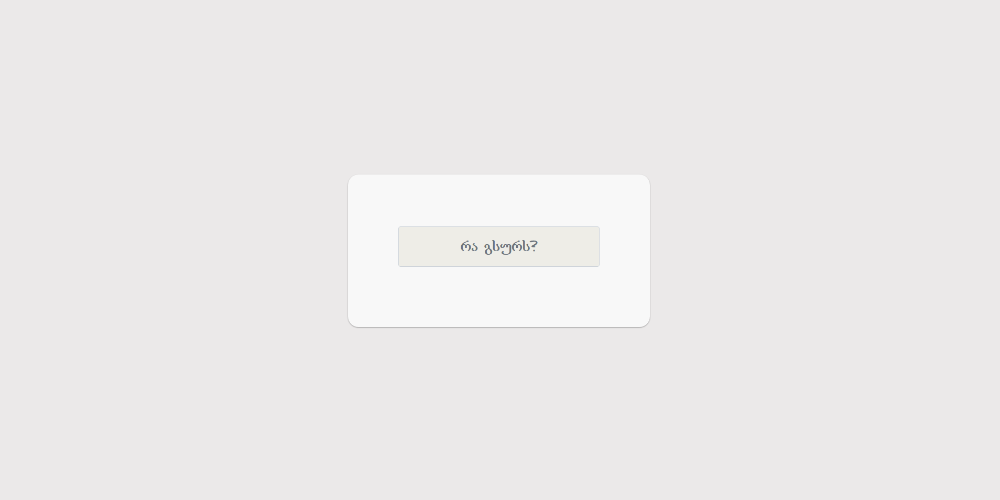
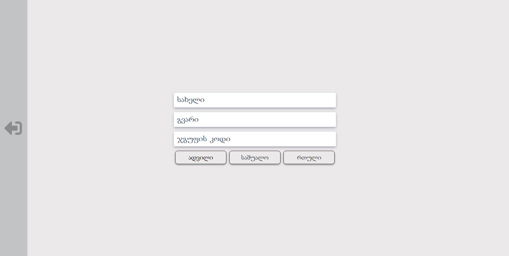
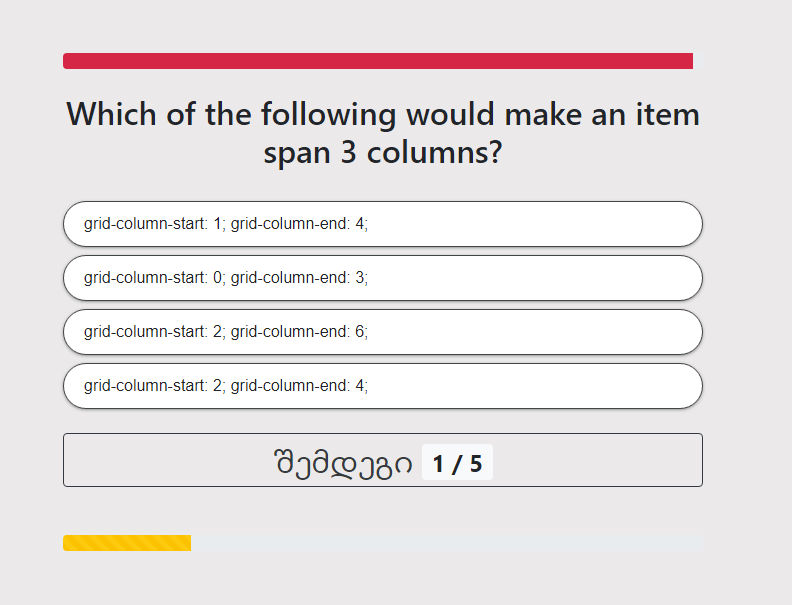
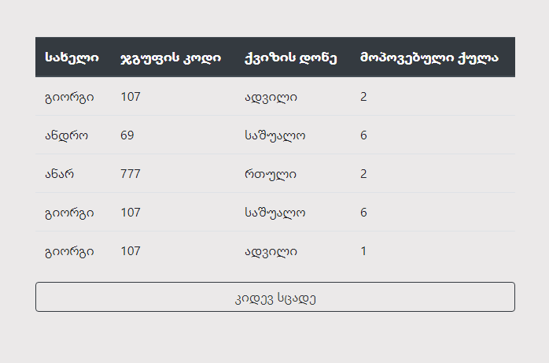
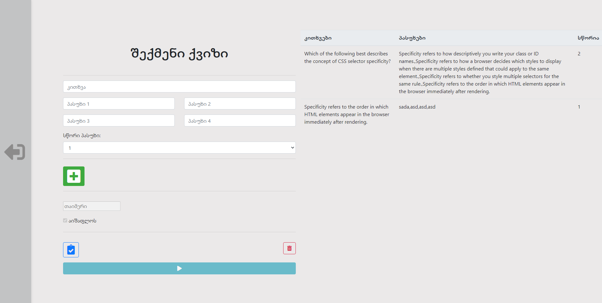
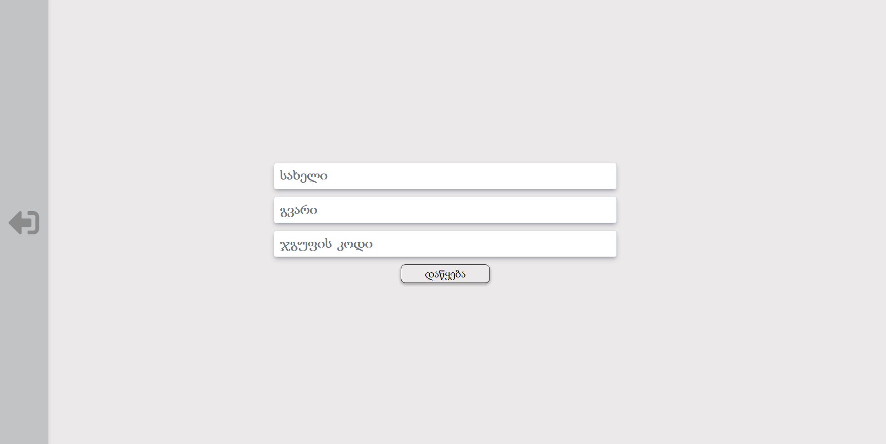
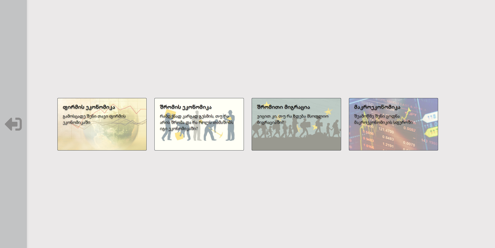
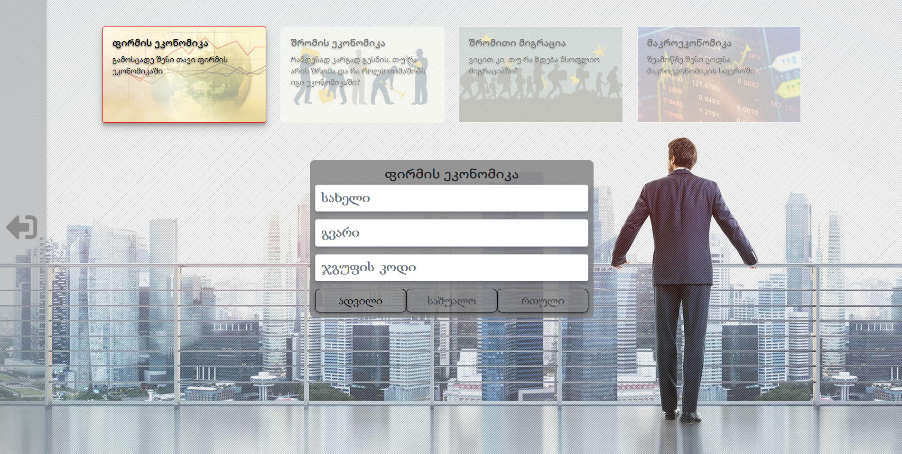

<b>ფინალური პროექტი</b>

 

---

#### შინაარსი
* [შესავალი](#shesavali)
* [ძირითადი ქვიზი](#pirveliSeqcia)
* [ქვიზის შექმნა](#meoreSeqcia)
* [ეკონომიკის ქვიზები](#mesameSeqcia)
* [Credits](#credits)

---

## 
შესავალი
 
პროექტი მოიცავს 3 ტიპის ტესტური ქვიზების სისტემას:
1. ძირითადი (დავალება);
2. ქვიზის შექმნა;
3. ეკონომიკის ქვიზები;

და 2 დამატებით გვერდს:
- კარი;
- ნავიგაცია;

>>>
კარი

_და_
>>>
ნავიგაცია

#### ახლა განვიხილოთ სამივე ტიპის ქვიზი

---

## 
ძირითადი ქვიზი
 
აქ ქვიზი იყოფა 3 განსხვავებული სირთულის ქვიზად (*მოცემულია ცხრილში*).

#### *ქვიზის სტრუქტურა* 
|ტიპი|კით. მოც. დრო|კით. რაოდენობა|
|---|---|---|
|ადვილი|30 წამი|5|
|საშალო|45 წამი|8|
|რთული|60 წამი|10|

- კითხვების *მაქსიმალური* რაოდენობაა 10, ხოლო *მინიმალური* 5.
- დროის *მაქსიმალური* ხანგრძლივობაა 1 წუთი , ხოლო *მინიმალური* 30 წამი.

მის დასაწყებად აუცილებელია მაიდენტიფიცირებელი ინფორმაციის შეყვანა. აღნიშნული ინფორმაცია ინახება ე.წ. Local Storage-ში.
ქივიზს დასრულებისას, ცხრილის სახით გამოაქვს მაიდენტიფიცირებელი ინფორმაციის გასწვრივ მიღებული ქულა და ასევე გთავაზობთ ქვიზის ხელახლა დაწყებას.
##### ფოტო-დოკუმენტაცია:

>>>
შესვლა

_,_
>>>
მიმდინარეობა

_და_
>>>
დასასრული

---

## 
ქვიზის შექმნა
 

ამ სექციაში ჩვენი ხელით შეგვიძლია ძალიან მარტივად შევქმნათ ახალი ქვიზი, რომლის კონტენტიც ასევე Local Storage-ში შეინახება.
მისი დამატებითი ფუნქციებია:
- შექმნილი კონტენტის ქვიზის დაწყებამდე ვიზუალურად გადახედვა(რომელიც იქვე გამოდის);
- თითო კითხვაზე დროის ხანგრძლივობის განსაზღვრა;
- კითხვების არათანმიმდევრულად მოსვლის არჩევა (აღნიშნული თავიდან გააქტიურებული იქნება);

##### ფოტო-დოკუმენტაცია:

ძირითადი ქვიზისგან განსხვავებით, ეს უკანასკნელი არ იყოფა სირთულეების მიხედვით და არც კითხვების რაოდენობა არაა შეზღუდული.

##### ფოტო-დოკუმენტაცია:

---

## 
ეკონომიკის ქვიზები
 

ეკონომიკის ქვიზების სექციაში მოცემულია ეკონომიკისა და ბიზნესის ფაკულტეტის 4 განსხვავებული თემატიკის ქვიზი.

ამ სექციის განსხვავებულობა მის შინაარსშია: გამოყენებულია **XMLHttpRequest** თითოეულ ქვიზზე დამოუკიდებლად.

##### ფოტო-დოკუმენტაცია:

დანარჩენი ყველაფერი იგივე პრინციპზეა აწყობილი, როგორც ძირითად ქვიზშია.

---

## 
Credits
 
პროექტში გამოყენებული ხელსაწყოების, ფონტებისა და ფერთა პალიტრის ჩამონათვალი:
- <a href="https://getbootstrap.com/docs/4.6/getting-started/introduction/">Bootstrap 4.6</a> :stuck_out_tongue_closed_eyes:
- <a href="https://fontawesome.com/">FontAwesome</a> :heart_eyes:
- Font families: Ubuntu Mono, Monospace :kissing_heart:
- *Color Palettes*: <a href="https://www.canva.com/colors/color-palettes/room-for-comfort/">Room for Comfort</a> & <a href="https://coolors.co/f94144-f3722c-f8961e-f9c74f-90be6d-43aa8b-577590">Just Palette</a> :sa:

